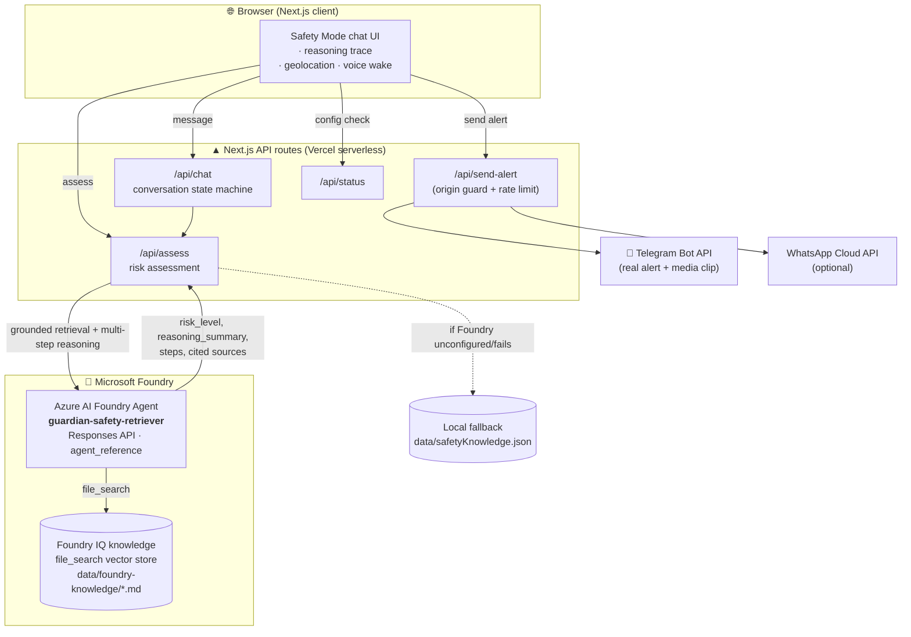

# Guardian AI Architecture

## Overview

Guardian AI is a Next.js App Router application that combines a browser chat UI, server-side risk reasoning, **Microsoft Foundry** retrieval-plus-reasoning, Telegram alert delivery, and optional WhatsApp Cloud API delivery.

The core of the system is a single **Azure AI Foundry agent** that performs both
grounded knowledge retrieval (Foundry IQ / `file_search` over the safety corpus)
and multi-step risk reasoning in one call — satisfying the Reasoning Agents
challenge's Microsoft Foundry requirement.



A plain-text version of the same flow:

```text
Browser (chat UI)
   -> /api/chat -> /api/assess --> Azure AI Foundry Agent --> Foundry IQ (file_search corpus)
                                |  (grounded retrieval + multi-step reasoning, one call)
                                `-> local JSON fallback if Foundry is unavailable
   -> /api/send-alert -> Telegram Bot API (+ optional WhatsApp)
```

## Runtime Flow

1. The user opens `/` and clicks Start Safety Mode.
2. `/safety` starts a short chat flow.
3. The user describes the situation.
4. The agent asks:
   - Can you speak safely?
   - Are you alone?
   - Is someone following or threatening you?
5. The user can share browser geolocation, use the demo location, or assess without location.
6. In assistant mode, the browser listens for "Guardian" and extracts the concern that follows it.
7. The client posts the assessment payload to `/api/assess`.
8. The payload includes typed or voice activation metadata.
9. The server retrieves safety knowledge through `retrieveSafetyKnowledge(query)`.
10. The server classifies risk and returns the action plan.
11. The UI displays the risk result, sources, and alert preview.
12. The user clicks Send Alert.
13. `/api/send-alert` sends a Telegram message and, if configured, also sends a WhatsApp Cloud API message. Missing WhatsApp credentials return a demo/skipped channel response.

## API Contracts

### POST /api/assess

Request:

```json
{
  "userMessage": "I feel unsafe walking home",
  "canSpeakSafely": true,
  "isAlone": true,
  "isBeingFollowed": false,
  "location": { "lat": 47.6062, "lng": -122.3321 },
  "activationMode": "voice",
  "audioClipStatus": "Wake phrase transcript captured in browser demo; production alert can attach the audio clip"
}
```

Response:

```json
{
  "risk_level": "MEDIUM",
  "reasoning_summary": "User is alone without immediate support.",
  "immediate_steps": ["Stay in a public, well-lit area with other people around"],
  "emergency_message": "[WARNING] SAFETY ALERT - MEDIUM RISK...",
  "retrieved_sources": ["Police Safety Advice"],
  "is_demo_mode": true
}
```

Voice activation metadata is rendered inside `emergency_message` so the alert preview makes the assistant path visible:

```text
Activation: Voice wake phrase "Guardian"
Emergency clip: Video attached when browser camera permission is allowed; audio fallback may be used
Video clip: Included when available.
```

### POST /api/send-alert

Request:

```json
{
  "message": "[URGENT] SAFETY ALERT - HIGH RISK..."
}
```

Response:

```json
{
  "success": true,
  "message": "Alert sent to Telegram. WhatsApp is not connected, so it was skipped.",
  "isDemoMode": false,
  "channels": {
    "telegram": {
      "success": true,
      "message": "Alert sent to Telegram.",
      "isDemoMode": false
    },
    "whatsapp": {
      "success": true,
      "message": "WhatsApp is not connected, so it was skipped.",
      "isDemoMode": true
    }
  }
}
```

### GET /api/status

Response:

```json
{
  "is_demo_mode": true,
  "foundry_configured": false,
  "telegram_configured": false,
  "whatsapp_configured": false
}
```

## Core Modules

### src/lib/foundryIQ.ts

This module owns the Foundry IQ boundary.

- `retrieveSafetyKnowledge(query)` is the public function.
- `isFoundryConfigured()` checks whether Foundry credentials exist.
- The real path calls Azure AI Foundry Agent Service.
- The fallback path filters `data/safetyKnowledge.json`.
- If the real call fails, the app logs the error and falls back to mock knowledge.

Real Foundry Agent flow:

```text
POST {projectEndpoint}/openai/v1/responses
send agent_reference in the request body
parse agent JSON risk assessment
merge file-search citations and model-reported sources
```

### src/lib/riskAssessment.ts

This module scores the situation and formats the agent result.

Risk inputs:

- User message keywords.
- Whether the user can speak safely.
- Whether the user is alone.
- Whether someone is following or threatening the user.
- Optional location.

Risk thresholds:

```text
HIGH   score >= 4
MEDIUM score 2-3
LOW    score < 2
```

### src/lib/telegram.ts

This module owns Telegram delivery.

- `sendTelegramAlert(message)` sends a real Telegram alert when credentials exist.
- If credentials are missing, it returns a demo success response.
- The demo response names a simulated trusted Telegram contact for judging clarity.

### src/lib/whatsapp.ts

This module owns optional WhatsApp Cloud API delivery.

- `sendWhatsAppAlert(message)` sends a real WhatsApp alert when WhatsApp Cloud API credentials exist.
- If credentials are missing, it returns a demo/skipped response so the MVP stays free to run.
- Media clips are attempted only for WhatsApp-supported media formats; browser WebM clips are usually better handled by Telegram in this MVP.

## Data Layer

`data/safetyKnowledge.json` contains local mock safety guidance with:

- category
- title
- content
- urgencyLevel
- sources

It supports demo mode and provides predictable fallback behavior.

## Demo Mode

Demo mode is active when either Foundry or Telegram credentials are missing. WhatsApp is optional and does not control demo mode.

Demo mode includes:

- Mock Foundry IQ retrieval.
- Demo location button.
- Assistant Mode panel with the wake phrase "Guardian".
- Browser speech recognition where available.
- Simulated trusted Telegram contact.
- Optional WhatsApp demo channel.
- Visible demo banner.
- No real Telegram emergency alert delivery unless Telegram credentials are configured.

## Environment Variables

```env
AZURE_AI_FOUNDRY_ENDPOINT=
AZURE_AI_FOUNDRY_API_KEY=
AZURE_AI_AGENT_NAME=
AZURE_AI_AGENT_VERSION=
TELEGRAM_BOT_TOKEN=
TELEGRAM_CHAT_ID=
WHATSAPP_ACCESS_TOKEN=
WHATSAPP_PHONE_NUMBER_ID=
WHATSAPP_RECIPIENT_PHONE=
WHATSAPP_GRAPH_API_VERSION=v23.0
```

## Security and Privacy

- No database.
- No authentication.
- No persistent user profiles.
- Location is only used in the current browser session and alert payload.
- Server secrets stay in environment variables.
- Demo mode avoids sending external messages.

## Deployment

Recommended deployment target: Vercel.

```text
GitHub public repo
        |
        v
Vercel Next.js deployment
        |
        +-- Azure AI Foundry Agent Service
        |
        +-- Telegram Bot API
        |
        `-- WhatsApp Cloud API (optional)
```

## Extension Points

- Add more local knowledge entries in `data/safetyKnowledge.json`.
- Replace mock retrieval with a richer Foundry IQ index or vector store.
- Add more alert channels behind new `/lib` adapters.
- Add voice input for situations where typing is unsafe.
- Add Azure Maps if future versions need richer location context.

## Safety Disclaimer

Guardian AI is a prototype only. It is not a replacement for emergency services, 911, or local emergency numbers.
